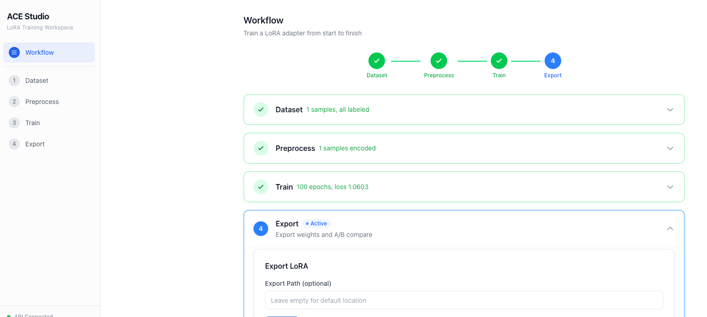
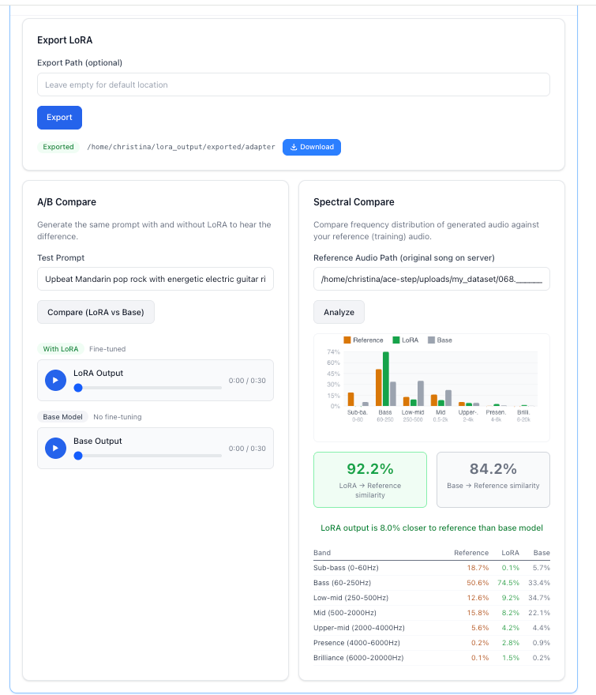

# ACE LoRA Training Studio

A web UI for fine-tuning [ACE-Step 1.5](https://github.com/ace-step/ACE-Step-1.5) with LoRA adapters. Upload your songs, train a style adapter, and verify the results with A/B listening tests and spectral analysis.

Built by [Christina Zhang](https://github.com/christinazhang139).

 

## What It Does

Train the ACE-Step music generation model to learn your musical style:

1. **Dataset** — Upload audio files, auto-label metadata (genre, BPM, key, lyrics)
2. **Preprocess** — Convert audio to training tensors
3. **Train** — Fine-tune LoRA or LoKR adapters with real-time loss curves
4. **Export** — Export trained weights as `.safetensors`, download to your computer
5. **A/B Compare** — Generate the same prompt with and without LoRA, listen side by side
6. **Spectral Compare** — FFT frequency analysis comparing LoRA output, base output, and your reference audio with cosine similarity scoring

### Screenshots

**Full training workflow** — all 4 steps on one page with progress tracking:



**Export + A/B Compare + Spectral Compare** — side-by-side listening and frequency analysis:



## About ACE-Step 1.5

ACE-Step is an open-source music generation model (CVPR 2026, MIT license) with two components:

| Component | Role | Options |
|-----------|------|---------|
| **DiT** (Diffusion Transformer) | Generates audio | 2B params (turbo/base/sft) or 4B XL variants |
| **LM** (Language Model, Qwen3-based) | Understands lyrics, generates metadata | 0.6B, 1.7B, or 4B |

### Model Variants

**DiT models** (pick one based on your GPU):

| Model | Params | Speed | Quality | HuggingFace |
|-------|--------|-------|---------|-------------|
| `acestep-v15-turbo` | 2B | Fast (8 steps) | Good | [ACE-Step/Ace-Step1.5](https://huggingface.co/ACE-Step/Ace-Step1.5) |
| `acestep-v15-base` | 2B | Normal (50 steps) | Better | [ACE-Step/acestep-v15-base](https://huggingface.co/ACE-Step/acestep-v15-base) |
| `acestep-v15-xl-base` | 4B | Normal (50 steps) | Best | [ACE-Step/acestep-v15-xl-base](https://huggingface.co/ACE-Step/acestep-v15-xl-base) |
| `acestep-v15-xl-turbo` | 4B | Fast (8 steps) | Very good | [ACE-Step/acestep-v15-xl-turbo](https://huggingface.co/ACE-Step/acestep-v15-xl-turbo) |

**LM models** (for lyrics understanding and auto-labeling):

| Model | Base | Size | HuggingFace |
|-------|------|------|-------------|
| `acestep-5Hz-lm-0.6B` | Qwen3-0.6B | ~0.6 GB | [ACE-Step/acestep-5Hz-lm-0.6B](https://huggingface.co/ACE-Step/acestep-5Hz-lm-0.6B) |
| `acestep-5Hz-lm-1.7B` | Qwen3-1.7B | ~1.7 GB | [ACE-Step/acestep-5Hz-lm-1.7B](https://huggingface.co/ACE-Step/acestep-5Hz-lm-1.7B) |
| `acestep-5Hz-lm-4B` | Qwen3-4B | ~4 GB | [ACE-Step/acestep-5Hz-lm-4B](https://huggingface.co/ACE-Step/acestep-5Hz-lm-4B) |

### GPU Requirements

| VRAM | What you can run |
|------|-----------------|
| 4-8 GB | 2B turbo only, no LM, CPU offload |
| 8-12 GB | 2B models + 0.6B LM |
| 12-16 GB | 2B models + 1.7B LM, XL with offload |
| 16-24 GB | XL models + 1.7B LM |
| 24 GB+ | XL models + 4B LM, full quality |

This project was developed and tested on an RTX 4090 (24 GB) with `acestep-v15-xl-base` (4B DiT) + `acestep-5Hz-lm-0.6B`.

## Quick Start

### Prerequisites

You need the ACE-Step 1.5 backend running. Follow the setup at [ACE-Step 1.5](https://github.com/ace-step/ACE-Step-1.5):

```bash
git clone https://github.com/ace-step/ACE-Step-1.5.git
cd ACE-Step-1.5
uv run acestep-api --host 0.0.0.0 --port 8001
```

Models download automatically on first run.

### Option 1: Run Locally (npm)

```bash
git clone https://github.com/christinazhang139/ace-lora-studio.git
cd ace-lora-studio
npm install
npm run build
npm start
```

Open http://localhost:3001. The frontend auto-connects to the backend at `http://localhost:8001`.

To point to a different backend:

```bash
NEXT_PUBLIC_API_URL=http://your-backend:8001 npm start
```

### Option 2: Docker Compose

```bash
git clone https://github.com/christinazhang139/ace-lora-studio.git
cd ace-lora-studio
docker compose -f deploy/local/docker-compose.yml up
```

Edit `deploy/local/docker-compose.yml` to set `NEXT_PUBLIC_API_URL` to your backend address.

### Option 3: OpenShift / Kubernetes

See [deploy/openshift/README.md](deploy/openshift/README.md) for full instructions.

```bash
docker build -f deploy/openshift/Dockerfile -t your-registry/ace-lora-studio:latest .
docker push your-registry/ace-lora-studio:latest
oc apply -f deploy/openshift/
```

## Project Structure

```
ace-lora-studio/
├── packages/ui/        # Shared component library (@ace/ui)
│   └── src/
│       ├── components/ # Button, Card, AudioPlayer, etc.
│       ├── hooks/      # usePolling, useAudioPlayer, useApiHealth
│       └── lib/        # API client, types, constants
├── studio/             # LoRA training app (Next.js)
│   └── app/
│       ├── workflow/   # Main training pipeline UI
│       ├── dataset/    # Dataset management
│       ├── train/      # Training controls
│       └── export/     # Export + A/B + spectral compare
└── deploy/
    ├── local/          # Docker Compose setup
    └── openshift/      # OpenShift/K8s manifests
```

## Environment Variables

| Variable | Default | Description |
|----------|---------|-------------|
| `NEXT_PUBLIC_API_URL` | `http://localhost:8001` | ACE-Step backend API address |
| `NEXT_PUBLIC_API_KEY` | (none) | Optional API authentication key |
| `ACESTEP_SAFE_ROOT` | `$HOME` | Root directory for file download access control |

Copy `.env.example` to `.env.local` to configure.

## Architecture

```
┌─────────────────────┐     HTTP/REST      ┌──────────────────────┐
│                     │ ◄──────────────── │                      │
│  ACE LoRA Training  │                    │   ACE-Step 1.5       │
│   (Next.js)         │ ──────────────── │   (FastAPI + PyTorch) │
│                     │   /v1/training/*   │                      │
│   Port 3000         │   /v1/lora/*       │   Port 8001          │
│                     │   /v1/dataset/*    │                      │
│                     │   /release_task    │   - DiT model        │
│                     │   /v1/audio        │   - LM model         │
│                     │                    │   - LoRA training     │
└─────────────────────┘                    └──────────────────────┘
        Browser                                GPU Server
```

## Tech Stack

- Next.js 16 with React 19
- TypeScript 5.8
- Tailwind CSS 4
- Web Audio API (spectral analysis)
- Canvas API (frequency charts)

## Troubleshooting

### LoRA output sounds like noise or static

The most common cause is **DCW (Differential Correction in Wavelet domain)** being enabled for XL models. DCW is designed for 2B models and produces garbled audio when used with 4B XL weights. Check these files in the ACE-Step backend and set `dcw=False` or `use_dcw=False` wherever it appears:

- `acestep/pipeline/ace_step_pipeline.py`
- `acestep/pipeline/ace_step_pipeline_wrapper.py`
- `acestep/pipeline/schedulers/scheduling_flow_match_euler_discrete.py`
- `acestep/api/http/infer_route.py`
- `configs/infer_config.yaml`

If your generated audio is pure noise, this is almost certainly why.

### Downloaded model weights don't match your config

`model_download.py` may not have a mapping for `xl-base`. When you specify `--model xl-base`, it could silently download 2B turbo weights instead of 4B XL weights. Verify the downloaded files match the expected size (~8 GB for XL vs ~4 GB for 2B). If wrong, download directly from HuggingFace:

```bash
huggingface-cli download ACE-Step/acestep-v15-xl-base --local-dir models/acestep-v15-xl-base
```

### Auto Label returns wrong metadata or 500 errors

Check your `.env` file. If it contains `ACESTEP_LM_MODEL_PATH=4B`, python-dotenv loads this before your command-line argument, so the API silently uses the 4B LM even if you started it with `--lm-model 0.6B`. Remove or comment out the `.env` entry if you want command-line args to take effect.

After restarting the API, you may also need to re-initialize the LM model:

```bash
curl -X POST http://localhost:8001/v1/init -H "Content-Type: application/json" \
  -d '{"init_llm": true}'
```

### Generated music sounds muffled or over-compressed

Lower `guidance_scale` to **7** for XL models. The default of 15 works for 2B turbo but over-constrains 4B models, producing flat dynamics. Set this in your generation request or in `configs/infer_config.yaml`.

## License

MIT. See [LICENSE](LICENSE).

The ACE-Step 1.5 model is also MIT licensed. See [ACE-Step 1.5 License](https://github.com/ace-step/ACE-Step-1.5/blob/main/LICENSE).
